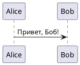
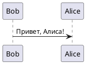

# Extract PlantUML from Markdown

## Описание
Этот скрипт рекурсивно ищет Markdown-файлы (`.md`) в указанной папке и извлекает из них блоки `plantuml`. Каждый найденный блок сохраняется в отдельный файл с расширением `.puml` в папке `resources`, расположенной рядом с исходным `.md`-файлом.

## Возможности
- Рекурсивный поиск всех `.md`-файлов в указанной директории.
- Извлечение блоков кода с разметкой `plantuml`.
- Автоматическое добавление `@startuml` и `@enduml`, если их нет в блоке.
- Создание (если отсутствует) папки `resources` рядом с каждым `.md`-файлом.
- Генерация `.puml`-файлов с именем `<имя md файла>_<номер>.puml`.

## Установка
Для работы скрипта требуется [Node.js](https://nodejs.org/).

### Клонирование репозитория
```bash
git clone <репозиторий>
cd <папка_проекта>
```

### Установка зависимостей
Этот скрипт не требует внешних зависимостей, так что никаких дополнительных установок не требуется.

## Использование
Запустите скрипт, передав путь к папке, в которой нужно выполнить поиск `.md`-файлов:

```bash
node extractPlantUML.js путь/до/папки
```

Пример:
```bash
node extractPlantUML.js resource
```

## Пример работы
Допустим, у нас есть файл `docs/example.md` со следующим содержимым:

````markdown
# Заголовок

Текст документа.

```plantuml
Alice -> Bob: Привет, Боб!
```

Дополнительный текст.

```plantuml
Bob -> Alice: Привет, Алиса!
```
````

После выполнения команды:
```bash
node extractPlantUML.js docs
```

Будет создана папка `docs/resources`, содержащая файлы:

```
docs/resources/example_1.puml
docs/resources/example_2.puml
```

Содержимое `example_1.puml`:


Содержимое `example_2.puml`:


## Лицензия
Этот проект распространяется под MIT лицензией.

